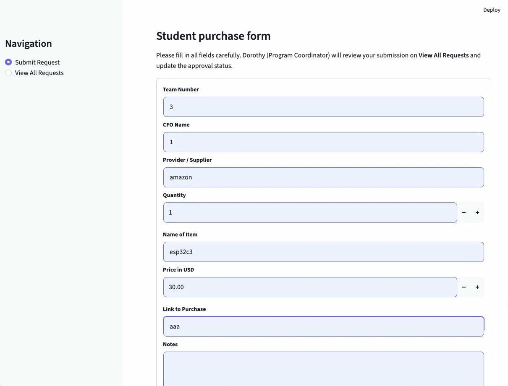
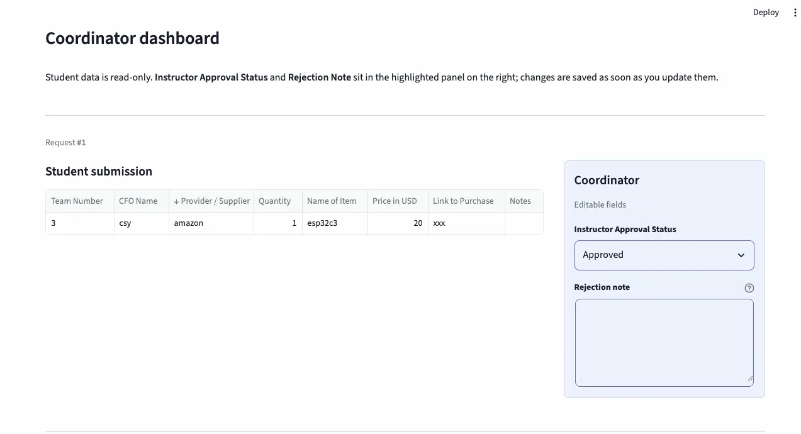

# Component D: Testing & Validation

## Smoke Test

| # | Feature Tested | Action You Took | Expected Result | Actual Result | Pass/Fail |
|---|---------------|-----------------|-----------------|---------------|-----------|
| 1 | Submit Request form | Filled in all fields (Team Number, CFO Name, Supplier, Quantity, Item Name, Price, Link, Notes) and clicked Submit | Success message appears and entry is saved | Green success message appeared and entry showed up correctly in View All Requests | Pass |
| 2 | View All Requests table | Clicked "View All Requests" in sidebar navigation | Table displays all submitted requests with all fields visible | Table displayed correctly with all columns and data | Pass |
| 3 | Coordinator Approval Status | Changed approval status dropdown from Pending to Approved on Dorothy's coordinator panel | Status updates and toast notification appears | Status changed to Approved and toast notification "Coordinator updates saved" appeared at bottom of screen | Pass |

## Quality Gate Checklist

- [x] Smoke test table completed with 3 tested features
- [x] Any failed test is either fixed and re-tested, or clearly documented
- [x] Screenshot of the running app included
- [x] Accessibility baseline results recorded (color contrast + semantic headings)

## Screenshots

## Accessibility Baseline Results

**Color Contrast:** PASS
- Text color: rgb(49, 51, 63)
- Background color: rgb(255, 255, 255)
- Contrast ratio exceeds 4.5:1 standard (WCAG AA)

**Semantic Headings:** PASS
- st.title() used once for main page title
- st.header() used for major sections
- st.subheader() used for subsections
- Heading order is correct, no levels skipped