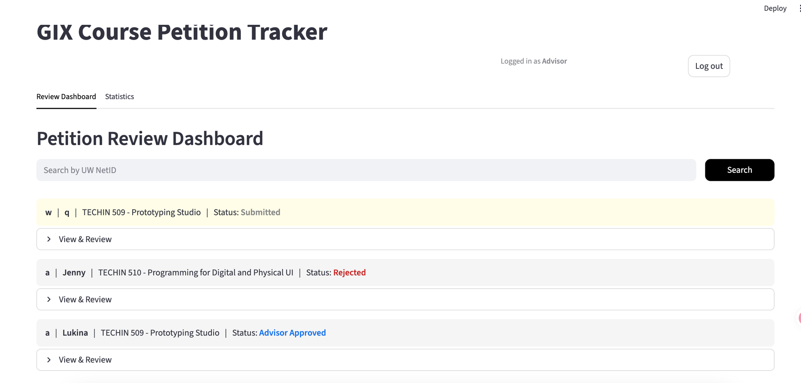
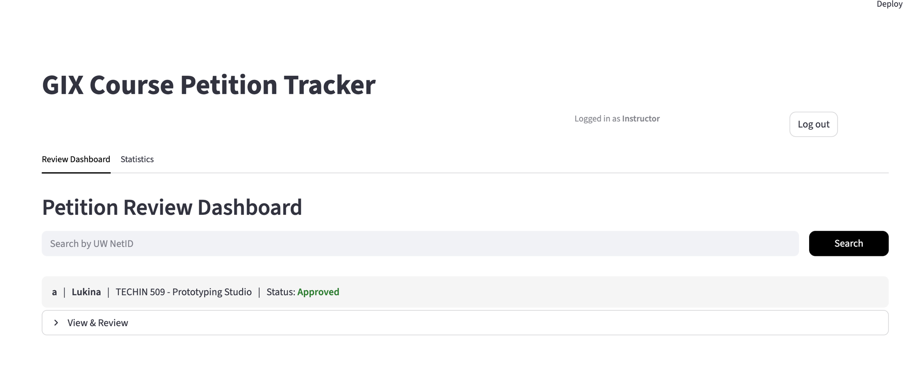

# TECHIN 510 — Week 2 Lab Report

**Student:** Lukina Chen
**Date:** April 2026

---

# Component A: Staff Interview

## Guest: Jason Evans, Academic Student Counselor (ASC) — Course Petition Syllabus Reviews

## Interview Notes

### What Jason Does
Jason reviews course petition documents — transcripts and syllabi — to determine if a student's previous coursework qualifies to waive a UW GIX course.

### Current Workflow
1. **Students submit** via Zoho form: transcript + syllabus (up to 3 external courses to waive 1 GIX course)
2. **Jason does initial review** (basic criteria check):
   - Is the transcript in English? (must be official university translation with stamp, not self-translated or LLM-translated)
   - Can he open the files?
   - Is the correct course submitted? (not a math class for a design class, etc.)
   - Does the student's grade meet the 2.7 minimum GPA requirement?
   - Highlights the relevant course on the transcript
3. **Jason compiles documents** — combines transcript + syllabus into one package per student
4. **Sends to course instructor** for expert review:
   - Instructor compares learning outcomes, deliverables, course level (needs UW 400+ equivalent)
   - 90% of learning outcomes must match the GIX course
   - Instructor gives approval/denial with notes
5. **Jason communicates results** back to students
6. **Edge cases**: one-on-one meetings with student and/or instructor if borderline

### Key Details
- Students can submit up to **3 courses** to waive **1 GIX course**
- **90% match** required on learning outcomes
- Comparison criteria: learning outcomes, deliverables, institution, course level, project vs. exam format
- Comparison method: word by word, keyword matching, understanding regional vocabulary differences
- **Credit limit**: students cannot waive more than allowed credits; must maintain 10 credits minimum per year
- **GIX syllabi change yearly** — need updated syllabus each year for comparison
- Documents kept for **5 cohorts**
- Timeline: ~1 month to review hundreds of syllabi and transcripts (e.g., early Oct to mid-Nov)
- Instructors given ~2 weeks to review; Jason sometimes has to send reminders
- Jason prioritizes by quarter (winter quarter courses first)

### Systems Used
- Zoho form for submissions
- Email for communications
- Spreadsheet for tracking approvals
- Multiple email systems set up for different response types

### LLM Experience
- Tried ChatGPT for syllabus comparison — not helpful
- Too generic, didn't provide detailed analysis of learning outcomes
- Just listed keywords without comparing specifics like projects vs. exams

## Emotional Journey

### Frustration Peaks (RED)
- **Emailing students one by one** for follow-ups: wrong format, not in English, self-translated, can't open files, missing documents
- **Students combining transcript and syllabus into one file** or submitting only one document instead of all required documents separately
- **Manually combining documents** — students submit transcript and each syllabus separately, Jason has to compile them all together, very time-consuming
- **Reviewing hundreds of syllabi takes hours and hours** — enormous volume during petition season
- **Mistyped student email addresses** in form submissions, requiring manual lookup

### Delight Moments (GREEN)
- **When students highlight the relevant course on their transcript** — saves Jason significant time
- **Clear-cut cases** where learning outcomes obviously match or obviously don't — quick decisions
- **When official English translations are provided** with university stamp — smooth process

### Uncertainty Zones (YELLOW)
- **Borderline cases** where learning outcomes partially match — requires instructor judgment and sometimes one-on-one meetings
- **Cross-disciplinary comparisons** (e.g., CNC machining vs. 3D printing) — Jason is not a subject matter expert, must rely on instructors
- **Regional vocabulary differences** — same concept, different terms across countries
- **When students submit more petitions than credits allow** — requires individual discussion about which to keep
- **Yearly syllabus changes** at GIX — need to update comparison baseline each year

## Problem Statement

"When Jason needs to review course petition syllabi for equivalency, he currently manually compiles documents, compares them word by word, and emails students individually for corrections, which causes hours of repetitive work and communication overhead during a compressed review timeline."

## Flowchart

```
[Student submits via Zoho form]
        |
        v
[Jason receives submission] --- (FRUSTRATION: mistyped emails, can't open files)
        |
        v
[Check: Documents complete?] --NO--> [Email student individually] --- (FRUSTRATION)
        |                                      |
       YES                                     v
        |                              [Student resubmits]
        v
[Check: Transcript in English?] --NO--> [Email student: need official
        |                                university translation]
       YES                               --- (FRUSTRATION: self-translated / LLM translated)
        |
        v
[Check: GPA >= 2.7?] --NO--> [Reject: does not meet minimum]
        |
       YES
        |
        v
[Check: Credits within limit?] --NO--> [One-on-one meeting with student]
        |                                --- (UNCERTAINTY)
       YES
        |
        v
[Jason highlights course on transcript]
--- (DELIGHT: when student pre-highlights it)
        |
        v
[Compile transcript + syllabi into one package] --- (FRUSTRATION: time-consuming)
        |
        v
[Check: Obviously wrong course type?] --YES--> [Reject]
        |
       NO / Plausible match
        |
        v
[Send compiled package to course instructor]
        |
        v
[Instructor reviews: 90% learning outcome match?]
--- (UNCERTAINTY: regional vocabulary, cross-discipline nuance)
        |
    /       \
  YES        NO
   |          |
   v          v
[Approved]  [Instructor adds notes on gaps]
   |          |
   |          v
   |    [Borderline?] --YES--> [One-on-one meeting: student + instructor]
   |          |                 --- (UNCERTAINTY)
   |         NO
   |          |
   v          v
[Jason emails result to student]
        |
        v
[Documents archived (kept for 5 cohorts)]
```

Color Code: RED = Frustration peaks, GREEN = Delight moments, YELLOW = Uncertainty zones

---

# Component B: AI Usage Log & Prompt Log

## Warm-up: Model Comparison

### Prompt Used (same for both tools)
```
Write a Python function that takes a list of student records (dictionaries with
"name", "program", and "gpa" keys) and returns only the students in a given
program with a GPA above a given threshold. Include error handling.
```

### Tool 1: Claude Code
```python
def filter_students(
    records: list[dict], program: str, gpa_threshold: float
) -> list[dict]:
    if not isinstance(records, list):
        raise TypeError("records must be a list")
    if not (0 <= gpa_threshold <= 4.0):
        raise ValueError("gpa_threshold must be between 0 and 4.0")

    results = []
    for student in records:
        if not isinstance(student, dict):
            continue
        if not all(key in student for key in ("name", "program", "gpa")):
            continue
        if student["program"] == program and student["gpa"] > gpa_threshold:
            results.append(student)
    return results
```

### Tool 2: ChatGPT
```python
def filter_students(records, program, min_gpa):
    if not isinstance(records, list):
        raise TypeError("records must be a list")
    if not isinstance(program, str):
        raise TypeError("program must be a string")
    if not isinstance(min_gpa, (int, float)):
        raise TypeError("min_gpa must be a number")

    filtered = []
    for i, record in enumerate(records):
        try:
            if not isinstance(record, dict):
                raise ValueError(f"Record at index {i} is not a dictionary")
            for key in ["name", "program", "gpa"]:
                if key not in record:
                    raise KeyError(f"Missing key '{key}' in record at index {i}")
            if not isinstance(record["gpa"], (int, float)):
                raise ValueError(f"GPA must be numeric in record at index {i}")
            if record["program"] == program and record["gpa"] > min_gpa:
                filtered.append(record)
        except Exception as e:
            print(f"Skipping invalid record at index {i}: {e}")
    return filtered
```

### Observations

1. **Code style**: Claude Code used type hints and a concise style — invalid records are silently skipped with `continue`. ChatGPT did not use type hints but provided detailed error messages with index numbers, making debugging easier.

2. **Error handling**: ChatGPT was more thorough — it validated the `program` parameter type, checked each record's GPA type individually, and wrapped each record in a try/except with `print()` logging. Claude Code only validated `records` type and `gpa_threshold` range, silently skipping bad records without logging.

3. **Explanation quality**: ChatGPT included a usage example with test data showing expected output. Claude Code provided a cleaner docstring with Args/Returns/Raises sections but no usage example. ChatGPT's approach is more beginner-friendly; Claude Code's is more professional/library-style.

## Level 2: Three Cursor Modes (completed via Claude Code)

### Step 2.2: Composer/Agent — Add a Feature
- **Prompt**: "Add a Petition Statistics page with Plotly charts showing petition count by status and by GIX course"
- **Output**: Added `render_statistics_page()` with metric cards and two Plotly bar charts. Also added login system, file upload per course, and PDF preview for advisor.
- **What it did**: Generated a full statistics dashboard and multi-feature enhancement across the app.

### Step 2.3: Chat — Understand Code
- **Code selected**: PDF display code using `base64` + `iframe` in the reviewer dashboard
- **Question asked**: "Is `st.write(f"**Transcript:** {c['transcript_filename']}")` what displays the file?"
- **Answer**: No. That line only displays a bold text label showing the filename. The actual PDF rendering happens through these steps:
  1. `transcript_file.read_bytes()` — reads the PDF file into binary data
  2. `base64.b64encode(transcript_bytes).decode()` — converts the binary into a base64-encoded string, because HTML cannot embed raw binary data
  3. `st.markdown(f'<iframe src="data:application/pdf;base64,{transcript_b64}" ...></iframe>')` — this is the line that actually renders the PDF inline using an iframe with a data URL
  4. The `else` branch with `st.caption()` is the fallback when the file doesn't exist — it just shows a gray text label
- **Follow-up insight**: The `data:application/pdf;base64,...` pattern is a way to embed file content directly into HTML without needing a separate file URL.

### Step 2.4: Inline Edit — Refactor
- **Prompt**: "Extract the repeated PDF display code into a reusable function"
- **Output**: Created `display_pdf()` helper function, reducing duplicated transcript/syllabus display logic from ~20 lines to 2 function calls.
- **What it did**: Improved code maintainability without changing behavior.

## Information Hierarchy Review

### Squint Test — Top 3 Elements
1. Title: "GIX Course Petition Tracker"
2. Section header: "Submit a Course Petition"
3. Course subheaders (Course 1/2/3) and Submit button

### Evaluation
| Question | Answer |
|----------|--------|
| Most important info on the page? | The title and submission form |
| Is it the most visually prominent? | Yes |
| Can a first-time user understand the app? | Yes |
| Are related items grouped together? | Yes |
| Any element that draws attention but is not important? | No |

### Hierarchy Fix
- **Changed title by role**: Students see "GIX Course Petition Form", advisors see "GIX Course Petition Tracker" — clearer purpose for each audience.
- **Bolded all form field labels** using CSS injection — labels were previously normal weight and blended with placeholder text.

## Prompt Engineering Log (Level 3)

### Spec (written before prompting)
1. **What should it do?** Advisor can search petitions by student UW NetID and visually distinguish reviewed vs. unreviewed petitions.
2. **What inputs does it take?** A UW NetID typed into a search box on the advisor dashboard.
3. **What should the output look like?** Filtered petition list sorted by time, with a check mark on reviewed petitions, and bold NetID + student name on each card.

### Prompt 1 — Vague
- **Prompt**: "Add a search bar to the advisor page"
- **Output**: Added a basic `st.text_input("Search")` that filters by student name. No icon, no placeholder, no visual distinction for reviewed items.
- **What AI assumed**: Searched by name (not NetID), no styling, label said "Search", triggered on every keystroke.

### Prompt 2 — Specific
- **Prompt**: "Add a search box with a magnifying glass icon below Petition Review Dashboard. Search by UW NetID. Add spacing below the search box. Show a check mark on reviewed petitions. Remove the 'Search' label text."
- **Output**: Added magnifying glass icon with placeholder text, collapsed label, spacing below search box, check mark on reviewed petitions. Searched by email field. Added empty-state message.
- **What improved**: Search field, placeholder, icon, reviewed indicator, spacing.

### Prompt 3 — Constrained
- **Prompt**: "Add a rounded (border-radius 10px) Search button to the right of the search box. The check mark should be on the far right of each card, not right after the status text. Keep the Status label. Show UW NetID and student name bold in the card header and inside the expanded view. Add more spacing around the | separators. Sort petitions by submission time, newest first."
- **Output**: Added a "Search" button with rounded corners, check mark pushed to the right, Status label kept, NetID and student name shown bold, wider spacing, sorted by time.
- **What improved**: Every visual detail specified was implemented.

### Reflection on Progression
1. **Biggest difference**: Vague prompt produced a generic search box with wrong field. Constrained prompt produced exactly the UI described.
2. **What mattered most**: Behavior details (button vs. enter key) and visual layout (bold, spacing, icon position) had the biggest impact.
3. **AI assumptions vs. instructions**: In the vague prompt, ~90% was AI assumptions. In the constrained prompt, ~90% came from explicit instructions.

---

# Component C: System Architecture & Design

## Architecture Diagram

```
┌─────────────────────────────────────────────────────────────────────┐
│                        YOUR CODE (you own this)                     │
│                                                                     │
│  ┌──────────┐   ┌──────────────┐   ┌────────────┐   ┌───────────┐ │
│  │ app.py   │   │ petitions    │   │ uploads/   │   │ .streamlit│ │
│  │          │   │ .json        │   │ (PDFs)     │   │ config    │ │
│  │ - Login  │   │              │   │            │   │ .toml     │ │
│  │ - Student│◄─►│ Data storage │   │ File       │   │           │ │
│  │ - Advisor│   │ (read/write) │   │ storage    │   │ Theme     │ │
│  │ - Instr. │   │              │   │            │   │ settings  │ │
│  │ - Stats  │   └──────────────┘   └────────────┘   └───────────┘ │
│  └────┬─────┘                                                       │
└───────┼─────────────────────────────────────────────────────────────┘
        │
 ═══════╪═══════════════════ BOUNDARIES ══════════════════════════════
        │
        ▼
┌───────────────────────────────────────────────────────────────────┐
│                    EXTERNAL LIBRARIES (you call them)             │
│  ┌───────────┐   ┌──────────┐   ┌──────────┐   ┌──────────────┐ │
│  │ Streamlit │   │ Plotly   │   │ Pandas   │   │ Python std   │ │
│  │ UI render │   │ Charts   │   │ DataFrames│  │ lib (json,   │ │
│  │ Widgets   │   │ Graphs   │   │ Analysis │   │ pathlib, etc)│ │
│  └───────────┘   └──────────┘   └──────────┘   └──────────────┘ │
└───────────────────────────────────────────────────────────────────┘

 ═══════════════════════════ BOUNDARIES ══════════════════════════════

┌───────────────────────────────────────────────────────────────────┐
│               AI TOOLS (they propose, you decide)                 │
│  ┌─────────────┐          ┌──────────────┐                       │
│  │ Claude Code │          │ Cursor       │                       │
│  │ Reads:      │          │ Reads:       │                       │
│  │ - CLAUDE.md │          │ - .cursorrules│                      │
│  │ - All files │          │ - All files  │                       │
│  └─────────────┘          └──────────────┘                       │
│                                                                   │
│  Config boundary: .cursorrules and CLAUDE.md are YOUR             │
│  instructions to THEIR system.                                    │
└───────────────────────────────────────────────────────────────────┘

 ═══════════════════════════ BOUNDARIES ══════════════════════════════

┌───────────────────────────────────────────────────────────────────┐
│            EXTERNAL SERVICES (you push/pull, they host)           │
│  ┌──────────────┐          ┌──────────────────┐                  │
│  │ GitHub       │          │ Browser          │                  │
│  │ Code hosting │          │ Renders the      │                  │
│  │ Version ctrl │          │ Streamlit app    │                  │
│  └──────────────┘          └──────────────────┘                  │
└───────────────────────────────────────────────────────────────────┘
```

## Design Decision Log

### Decision: Where should project context live?

| Field | Entry |
|-------|-------|
| **Decision** | Put project context in both `.cursorrules` and `CLAUDE.md`, tailored to each tool. One-time instructions go in prompts. |
| **Alternatives considered** | (1) Only `.cursorrules`. (2) Only prompts. (3) Identical content in both. |
| **Why I chose this** | Each tool reads a different config file. Putting standards in config files means I don't repeat them every prompt. |
| **Trade-off** | Must update both files when the project changes. Risk of going out of sync. |
| **When would I choose differently?** | If using only one AI tool, or if the project were very small. |

### What belongs where?

| Information | Where | Why |
|-------------|-------|-----|
| Coding standards | Config files | Applies to all code generation |
| Business logic (approval flow) | Config files | Critical rules AI must always follow |
| "Add a search bar" | Prompt | One-time task |
| "Use Matplotlib here" | Prompt | Exception to the default |
| Run commands | CLAUDE.md only | Claude Code can run commands; Cursor cannot |

---

# Component D: Testing & Validation

## Prompt Regression Test Results

### Smoke Test
- [x] All outputs run without errors
- [x] Core behavior works
- [x] Invalid input handled without crashing

### Recording Template

| # | Prompt Used | Without Config (Before) | With Config (After) | What Changed | Better/Worse/Same |
|---|-------------|------------------------|--------------------|--------------|--------------------|
| 1 | "Add a statistics section to the reviewer dashboard" | Used Matplotlib, no type hints, no docstring | Used Plotly, Google-style docstring, added type hints, used project color palette | Switched to Plotly and added type hints per .cursorrules | Better |
| 2 | "Explain the display_pdf function step by step" | Generic explanation, no project context | Referenced advisor dashboard, uploads/ directory, and project conventions | Used project context from CLAUDE.md | Better |
| 3 | "Add error handling so the app doesn't crash if petitions.json is corrupted" | Bare except clause, no user message | Specific exception types, added st.warning() message and docstring | Followed Streamlit conventions from config | Better |

## Quality Gate Checklist

- [x] Smoke test completed
- [x] 3 prompts tested with before/after observations
- [x] Differences are specific and concrete
- [x] Config files restored and working
- [x] Honest assessment
- [x] Prompts documented for reproducibility

---

# Component E: Applied Challenge — The Prompt Showdown

## 5-Sentence Specification

1. The Quick Eligibility Checker is a Streamlit web app that determines which GIX career events a student qualifies for based on their program, graduation quarter, and CPT authorization status.
2. The student inputs their program (MSTI or GIX PMP), expected graduation quarter (e.g., Spring 2026, Summer 2026), and whether they have CPT authorization (Yes / No / Pending).
3. The app evaluates eligibility for four career events: Mock Interviews, Resume Reviews, Employer Panels, and Networking Nights, each with different qualification criteria.
4. The output displays a clear list of events with "Eligible" or "Not Eligible" labels, color-coded green or red, along with a brief reason for each decision.
5. Edge cases — such as students with pending CPT status or those graduating in the current quarter — are flagged for human review by a career services advisor rather than auto-decided by the tool.

## Decision Flowchart

```
[Student enters: Program, Graduation Quarter, CPT Status]
                    |
                    v
        ┌───────────────────────┐
        │ Is Program valid?     │
        │ (MSTI or GIX PMP)     │
        └───────┬───────────────┘
                |
           YES  |  NO → Display error
                v
        ┌───────────────────────┐
        │ Check CPT Status      │
        └───────┬───────────────┘
                |
        ┌───────┼───────────────┐
       YES    PENDING           NO
        |       |               |
        |    ⚠ HUMAN REVIEW    |
        v                       v
   [Full access]         [Limited access]
                    |
                    v
  ┌─────────────────────────────────────────┐
  │ 1. Mock Interviews                      │
  │    └─ Graduating within 2 quarters?     │
  │       YES → Eligible | NO → Not Eligible│
  │                                         │
  │ 2. Resume Reviews                       │
  │    └─ All students → Eligible           │
  │                                         │
  │ 3. Employer Panels                      │
  │    └─ CPT = Yes → Eligible              │
  │       CPT = No → Not Eligible           │
  │                                         │
  │ 4. Networking Nights                    │
  │    └─ All programs → Eligible           │
  │                                         │
  │ ⚠ HUMAN REVIEW:                        │
  │    Graduating THIS quarter + No CPT     │
  │    → Consult career advisor             │
  └─────────────────────────────────────────┘
```

Decision Branches: (1) CPT Status, (2) Graduation timing, (3) Graduating this quarter + no CPT

## Comparison Table

| Dimension | Claude Code | ChatGPT |
|-----------|------------|---------|
| Code length | ~60 lines, compact | ~180 lines, modular |
| Architecture | Single inline script | Separated helper functions |
| Type hints | None | Full type hints |
| Error handling | Basic field check | Comprehensive with ValueError |
| UI framework | No form, individual widgets | Uses st.form() |
| Result display | st.success/st.error (built-in) | Custom HTML badges with colors |
| Human review | Separate warning messages | "Human Review Required" as third status |
| Quarter calculation | Hardcoded list | Parsed with arithmetic |

## Smoke Test

| Test | Claude Code | ChatGPT |
|------|------------|---------|
| App starts without error | Yes | Yes |
| Core path works | Yes | Yes |
| Invalid input handled | Yes | Yes |

## Input Testing

### Valid Input (Program: MSTI, Graduation: Summer 2026, CPT: Yes)
- **Claude Code**: All four events show Eligible
- **ChatGPT**: Same — all four events show Eligible with green badges

### Invalid Input (Program: MSTI, Graduation: Spring 2026, CPT: No)
- **Claude Code**: Warning banner + Mock Interviews Eligible, Employer Panels Not Eligible
- **ChatGPT**: Both Mock Interviews and Employer Panels show "Human Review Required" with yellow badge

---

# App Screenshots

## Advisor Dashboard


## Instructor Dashboard


---

# Reflection

**Tool comparison:** When testing the same prompt across Claude Code and ChatGPT, the biggest difference was in code structure and defensiveness. Claude Code produced compact, readable code that got the job done quickly, while ChatGPT wrote more modular code with separate helper functions, full type hints, and detailed error handling. Claude Code gave better explanations that referenced the project context, while ChatGPT gave better standalone code that was more self-documenting. Neither was strictly "better" — they have different strengths depending on whether you need speed or structure.

**Prompt quality:** The most important thing I learned is that writing a specific prompt is not just about getting better AI output — it forces you to think more carefully about what you actually want. When I wrote the vague prompt "add a search bar," I had not thought through which field to search, how to trigger the search, or how to show results. Writing the constrained prompt made me consider these details before the AI even started, which meant I caught design issues early. So prompt engineering is really a thinking tool, not just a communication tool — it adds an extra round of reflection on whether your requirements are clear and feasible.

**Configuration impact:** Configuration files like `.cursorrules` and `CLAUDE.md` act as a persistent brief for AI tools — they eliminate the need to repeat project conventions in every prompt. Without config files, the AI used Matplotlib, skipped type hints, and wrote bare `except:` clauses. With config files, it consistently used Plotly, added Google-style docstrings, and followed Streamlit conventions like `st.warning()`. The key insight is that config files do not make the AI smarter — they just give it the same context a human teammate would need on their first day, so it makes consistent choices aligned with your project.
